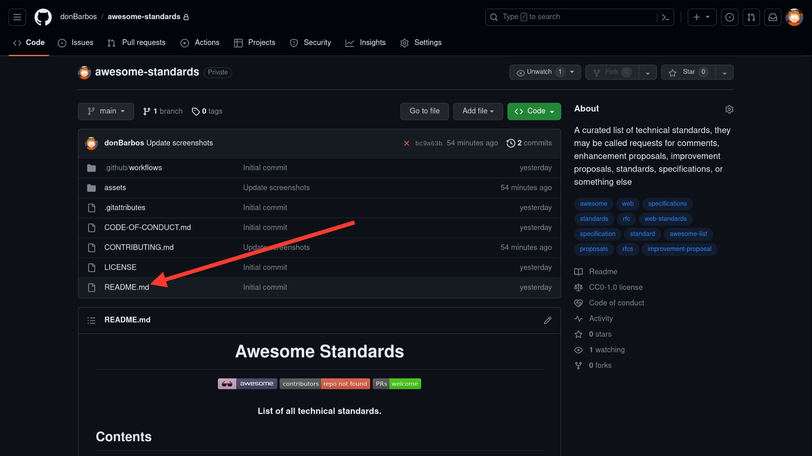
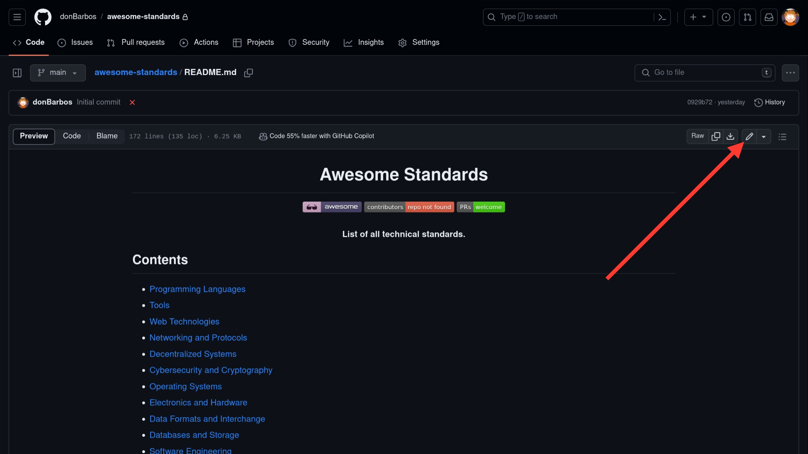
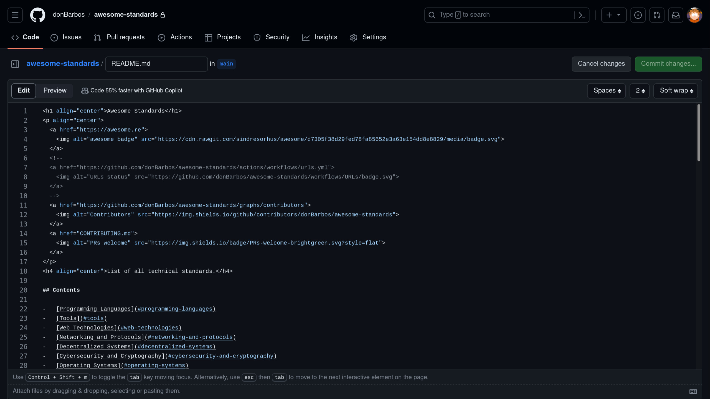
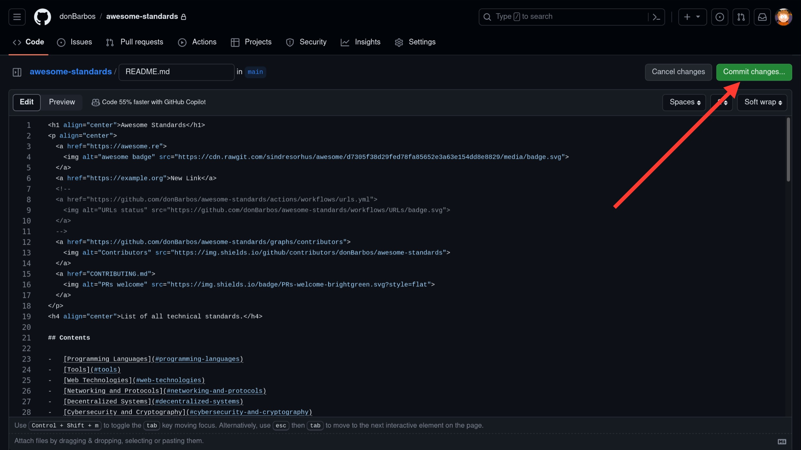
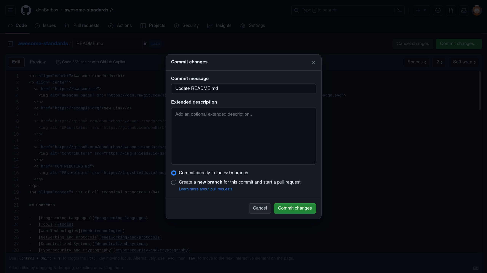

# Contribution Guidelines

Please note that this project is released with a [Contributor Code of Conduct](CODE-OF-CONDUCT.md). By participating in this project you agree to abide by its terms.

Ensure your pull request adheres to the following guidelines:

- Use the following format: `- [Resource Name](link) - Description.`
- Make sure you run linter: `npx awesome-lint`
- And this as well: `npx prettier --write README.md`

Thank you for your suggestions!

## Adding something to an awesome list

If you have something awesome to contribute to an awesome list, this is how you do it.

You'll need a [GitHub account](https://github.com/join)!

1. Access the awesome list's GitHub page. For example: https://github.com/donBarbos/awesome-standards
2. Click on the `README.md` file: 
3. Now click on the edit icon. 
4. You can start editing the text of the file in the in-browser editor. Make sure you follow guidelines above. You can use [GitHub Flavored Markdown](https://help.github.com/articles/github-flavored-markdown/). 
5. Click on "Commit changes...". 
6. Say why you're proposing the changes, and then click on "Commit changes". 
7. Submit the [pull request](https://help.github.com/articles/using-pull-requests/)!

## Updating your PR

A lot of times, making a PR adhere to the standards above can be difficult. If the maintainers notice anything that we'd like changed, we'll ask you to edit your PR before we merge it. There's no need to open a new PR, just edit the existing one. If you're not sure how to do that, [here is a guide](https://github.com/RichardLitt/knowledge/blob/master/github/amending-a-commit-guide.md) on the different ways you can update your PR so that we can merge it.
